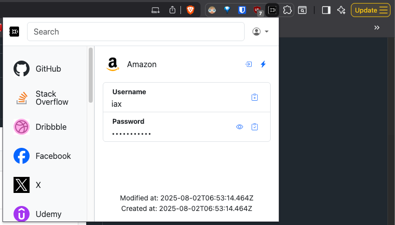

# SafePass Extension

SafePass Extension is a Chrome browser extension that acts as a client for the Rails project [SafePass](https://github.com/iax7/safepass). It allows you to securely manage and autofill credentials directly from your browser.



## Features

- Autofill usernames and passwords on websites
- Secure session token storage
- Search and filter entries
- One-click copy to clipboard
- Quick navigation to saved sites
- Modern, responsive interface

## Development

1. Clone this repository:

   ```sh
   git clone https://github.com/iax7/safepass-extension.git
   cd safepass-extension
   ```

2. Install dependencies:

   ```sh
   yarn install
   ```

3. Build the project:

   ```sh
   npm start
   ```

4. Load the extension in Chrome:
   - Go to `chrome://extensions/`
   - Enable "Developer mode"
   - Click "Load unpacked" and select the `dist` folder

Related Project: [SafePass](https://github.com/iax7/safepass)
